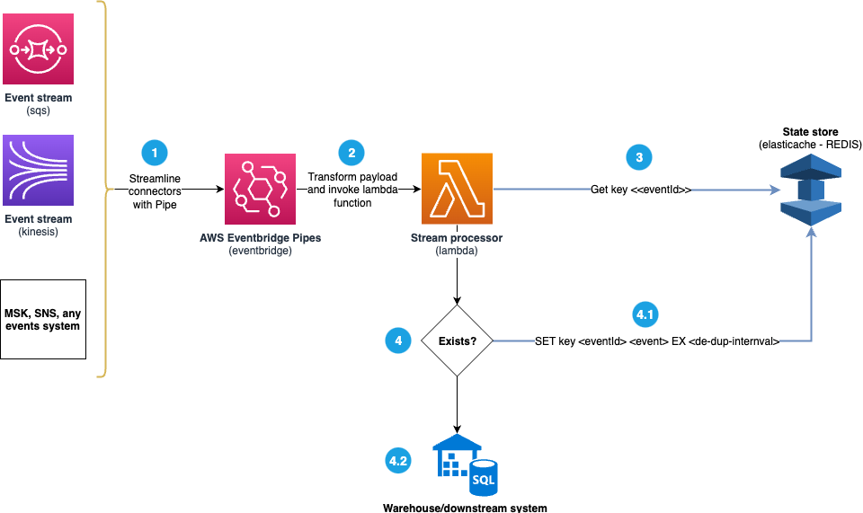
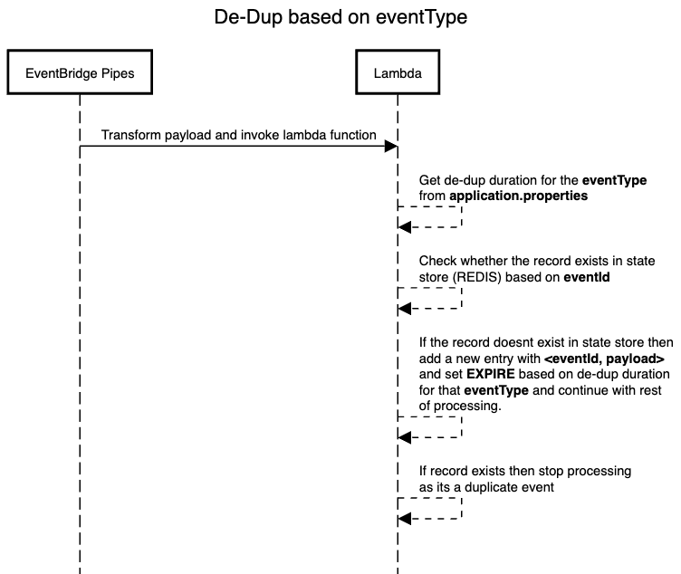

# Efficient Event Streamlining and Dynamic De-Duplication Across Message Brokers - A Technology-Agnostic approach

## Introduction
Nowadays, every modern application emits large amounts of data that needs to be processed and stored to derive meaningful business insights. The data from different sources (like web, mobile, etc.) through message brokers (like Kinesis, SQS, Kafka, etc.) can be unstructured with many duplicate data. All this data need to get processed in real-time and stored in a data warehouse for further analysis. 

As a developer, if you are tasked with building a central system that can process data from these different message brokers, run de-dups based on the individual dataset, and store them in a data warehouse, then the blog is for you.

As part of this blog, we will dive deep into the following topics:
* What are the common problems when dealing with different message brokers?
* What are some general solutions that people implement to solve these problems?
* How to build a system that streamlines data processing across different message brokers?
* How can we build a dynamic de-duplication window based on the dataset using a state store thats independent of the message broker used for ingestion? 
* How can I scale each of the components in the system independently?

## Common problems
Here are some common problems that every developer faces when building a system that receives data from different message brokers:

* **Diversified message brokers:** Depending upon the use case, different teams may use different message brokers to receive data from their sources. For example, a team may use SQS because it is a fully managed service, and they don't want to worry about the operational overhead of managing a message broker. Another team may use Kinesis because it is a good fit for real-time applications, and they would like to share the data based on the volume and payload size. So, to build a system that reads data from different message brokers, we need to develop connectors for each of them, which involves writing a lot of boilerplate code to read data, handle retries, handle errors, etc. This is a very tedious task, and it isn't easy to maintain.

* **De-Duplication in scale:** When the sources emit events, they may end up publishing the same event multiple times (may be due to network issues or due to retries). So, the processing system needs to perform de-dups on these events based on an attribute inside the message payload before storing it in the data warehouse. Depending upon the de-dup options the message broker provides and the use case we are trying to solve, this will be a challenge. For example, if we use SQS, we can perform de-dups based on the message id, and the max de-dup window is 14 days. Using Kinesis, we can perform de-dups based on the sequence number, and the max de-dup window is 24 hours. So we may temporarily store these events in a data store, then combine them using another data pipeline to fully de-dup them. This solution may become very expensive and complex to maintain.

## Common solutions
Here are some common approaches that people try to solve these problems:

* Here are a few approaches that people try to solve **Diversified message brokers** problem:
  * **Standardize on a single message broker:** If we want to build a central system that processes data from different message brokers, we can use a single message broker technology like SQS or Kinesis. This is a simple solution to implement, but there are a few drawbacks, like:     
    * **Different events require different message brokers:** We should use a message broker that fits the use case well. For example, if the events are real-time, we can use Kinesis rather than standardizing everything on SQS because it's a fully managed service, which is not the right architectural fit for the use case.
    * **Scalability:** It would be ideal to scale the message broker depending upon the volume and payload size instead of one size fits all approach. With this approach, we may pay a lot of money for the message broker if we are not using it to its full potential.
  * **Separate connector for each message broker:** We can build a separate code connector for each message broker to read and process events from these individual message brokers. Even though this approach sounds simpler to build, we may pay the cost for maintenance. Here are some drawbacks of this approach: 
    * **Operational overhead:** This approach will require a lot of operational overhead to manage these connectors. For example, if we use ten message brokers (like SQS, Kinesis, MSK, SNS, etc.), we need to write ten connectors to read events from these message brokers. This will require a lot of resources to maintain these connectors.
    * **Cost:** This approach will increase the overall operational cost of running the system as w need to constantly monitor these connectors and their downstream dependencies to ensure new releases don't break the system.

* **De-Duplication in scale:** The general recommendations, in this case, would be to build an ETL pipeline that can read and write temporary data multiple times to a data warehouse to enable de-dups independent of the message broker. But building an ETL pipeline always requires introducing new technology and hiring resourcing to manage these pipelines in the longer term, which may only be feasible for large-scale enterprises.
  
## Proposed solution

### Solution overview
The solution highlighted in this blog uses AWS Eventbridge pipes to streamline events from different message brokers into a standard format and then push these events into a central processing system deployed as Lambda functions. The Lambda functions will perform de-dups on the events based on an attribute inside the payload and pass it on to the downstream systems. The solution uses AWS Elastic Cache with REDIS as a state store to build and manage a dynamic de-duplication window. 

Here are a few advantages of this approach:
* **Single consumer**: All the events from different message brokers are streamed to a single consumer using AWS Eventbridge pipe into a standard format, so the consumer can process the events and not worry about the individual connectors, message brokers, and their request, response formats.
* **Cost effective**: The solution uses AWS Elastic Cache with REDIS as a state store to enable de-dups, so we don't need to rely on a message broker or an ETL pipeline to perform de-dups, which will reduce the overall cost of the system. The solution leverages the REDIS expiry feature (based on `TTL`) to implement a de-dup window for a given de-dup attribute instead of storing all the events in a database, which will be very expensive.
* **Scalability**: Each system part can be scaled independently. Here are some callouts:
  * Depending upon the volume and payload size, these individual message brokers can be scaled independently instead of one size fits all approach. 
  * In this solution, we use AWS Lambda to centralize the processing of events, so we can independently scale the Lambda function based on the number of events.
  * Since REDIS is used as a state store to build these dynamic de-dup windows, we can scale the REDIS cluster independently depending on the number of de-dup windows we want to maintain.

### Components used
We use following components to build the solution:

* AWS Eventbridge pipes - Amazon EventBridge Pipes helps you create point-to-point integrations between event producers and consumers with optional transform, filter and enrich steps. EventBridge Pipes reduces the amount of integration code you need to write and maintain when building event-driven applications.
* Amazon SQS -  Amazon SQS is a fully managed message queuing service that enables you to decouple and scale microservices, distributed systems, and serverless applications. 
* Amazon Kinesis streams - Amazon Kinesis Data Streams is a fully managed service that can continuously capture and store terabytes of data per hour from hundreds of thousands of sources such as web clickstreams, IoT devices, social media feeds, and application logs.
* Elastic cache with REDIS - Amazon ElastiCache is a web service that makes it easy to deploy, operate, and scale an in-memory cache in the cloud. The service improves the performance of web applications by allowing you to retrieve information from fast, managed, in-memory caches, instead of relying entirely on slower disk-based databases. In this blog we will use REDIS as a state store.
* AWS Lambda - AWS Lambda is a compute service that lets you run code without provisioning or managing servers. AWS Lambda executes your code only when needed and scales automatically, from a few requests per day to thousands per second. In this blog we will use AWS Lambda to implement the de-dup logic.

### Architecture overview
Here is the high level architecture of the solution:



The duration of the de-duplication window is based on the `eventType` attribute in the payload. For example, if the `eventType` is `IOT_EVENT,` then the de-duplication window is 5 mins; if the `eventType` is `IPAD_EVENT,` then the de-duplication window is 10 mins, etc. You can see the complete list of `eventType` and their corresponding de-duplication window in the `application.properties` file inside [samples folder](sample/event-processor/src/main/resources/application.properties). 

Here is the sequence of steps performed in the Lambda function when an event is received:



## Build and deploy the solution
In this section, we will build and the deploy the sample solution provided in this repository. The sample solution uses AWS CDK to deploy the solution. 

### Prerequisites
* We should instal AWS CDK on the local laptop. You can read more about it [here](https://docs.aws.amazon.com/cdk/latest/guide/getting_started.html)
* `Yarn` needs to be installed. You can check the installation status by running this command
* An AWS account with console and API access
* Docker desktop needs to be installed on the local laptop, you can read more about it [here](https://www.docker.com/products/docker-desktop)

### Build
Check out the code from this repository using this command:

```bash
> mkdir batch-processing-with-k8s && cd batch-processing-with-k8s
> git clone https://github.com/hariohmprasath/batch-processing-with-k8s.git .
```

> Note: Source code for the lambda functions is available under `sample` folder

### Deploy
Code for the sample application using this CDK construct is available in `src/cdk-stack.ts`. In order to deploy the application, first bootstrap a CDK environment (if you haven't done so already).

```bash
# Bootstrap CDK (ONLY ONCE, if you have already done this you can skip this part)
# Subsitute your AWS Account Id and AWS region in the command below
> cdk bootstrap \    
--cloudformation-execution-policies arn:aws:iam::aws:policy/AdministratorAccess \    
aws://<AWS Account Id>/<AWS_REGION>
```

Run the following command to start the deployment:

```bash
> cdk deploy --require-approval never
```

Once the deployment is successful, you will see the following output:

```bash
✅  CdkStack
✨  Deployment time: 74.26s

CdkStack.lambdafunctionnameoutput = CdkStack-lambda8B5974B5-l2e9KIGpc0wY
CdkStack.sqspipeoutput = arn:aws:pipes:us-east-1:xxxxxxx:pipe/queuepipe-J1zOtyqFYgzb
CdkStack.sqsqueuenameoutput = https://sqs.us-east-1.amazonaws.com/xxxxxxx/CdkStack-iotqueueA31B1355-2l2elNyH60LF
CdkStack.streampipeoutput = arn:aws:pipes:us-east-1:xxxxxxx:pipe/streampipe-VAF7zVSDN4Wp
Stack ARN:
arn:aws:cloudformation:us-east-1:xxxxxxx:stack/CdkStack/b40f1120-d389-11ed-ad64-12ec7f1ad233
```

## Testing the solution

1. Send a test event to SQS queue using this command:

```bash
> aws sqs send-message --queue-url https://sqs.us-east-1.amazonaws.com/xxxxxxx/CdkStack-iotqueueA31B1355-2l2elNyH60LF --message-body '%7B%22id%22%3A%221%22%2C%22eventType%22%3A%22IOT_EVENT%22%2C%22eventId%22%3A%22Event1%22%2C%22createdAt%22%3A11999111%2C%22body%22%3A%22Testevent%22%7D'
```

> Note: `QueueUrl` is available in the stack output. The message payload is encoded in UTF-8 format, you can use this [link](https://www.urldecoder.org/) to decode the message.

2. After sending the message, navigate to the AWS Lambda function specified in the stack output. Look at the execution logs and you will see the following output:

```bash
Inserting event in redis cache: {"id":"1","eventType":"IOT_EVENT","eventId":"Event1","createdAt":11999111,"body":"Testevent"}
```

> Note: Since we have invoked the lambda function for the first time, the event is not a duplicate and hence its saved in the REDIS cache and passed on to the downstream system.

3. Resend the same message using sqs send-message command, so basically you can simulate a duplicate event. Navigate back to the Lambda function and look at the execution logs. You will see the following output:

```bash
Event already exists in redis cache: {"id":"1","eventType":"IOT_EVENT","eventId":"Event1","createdAt":11999111,"body":"Testevent"}
```

> As we have not crossed the 5 mins de-dup window, the data in REDIS cache is not expired and the event is flagged as duplicate.

## Cleanup
Run the following command from the root directory to delete the stack

```bash
cdk destroy
```

## Conclusion
In this blog we have seen how we can streamline event processing across message brokers using AWS Eventbridge pipes and perform dynamic de-duplication using a state store. We have also deployed a sample solution using AWS CDK and tested it.